# Project LOOP 2.0 — Enterprise AI Customer Feedback Intelligence Platform

[](https://nextjs.org/)
[](https://www.typescriptlang.org/)
[](https://www.prisma.io/)
[](https://tailwindcss.com/)
[](https://docs.claude.com/)
[](https://nodejs.org/)
[](https://github.com/)

> **"Turn scattered customer feedback into defensible product strategy."**  
> LOOP 2.0 is an enterprise-grade Voice of Customer (VoC) Intelligence platform that ingests multi-channel customer signals (Zendesk, Intercom, Gong, Discord, App Stores, and CSVs), runs them through a multi-stage NLP intelligence pipeline (Sentiment + Confidence, Plutchik-8 Emotion Taxonomy, Aspect-Based Sentiment Analysis [ABSA], 9-class Intent Detection, Explainable 0–100 Severity Scoring, Churn Risk Detection, and Root Cause Analysis), and delivers hallucination-free executive insights backed by verified customer evidence.

---

## 🎯 Quick Demo Access (Pre-Seeded Acme Corp Workspace)

The platform comes pre-seeded with a production-grade multi-channel corpus (**127+ realistic customer feedback records**, active anomaly alerts, leadership AI recommendations, and product roadmap items).

| Role | Email | Password | Permissions & Scope |
| :--- | :--- | :--- | :--- |
| **Admin** | `admin@loop.dev` | `password123` | Full workspace governance: Manage members & RBAC, dataset ingestion & purge, triage, roadmap, VoC reports |
| **Analyst** | `analyst@loop.dev` | `password123` | Feedback ingestion (Single / CSV / Stream), triage status, trigger AI re-classification, push engineering tickets |
| **Viewer** | `viewer@loop.dev` | `password123` | Read-only executive access: Live dashboard, trends, query Ask LOOP AI Analyst |

---

## 🏛️ Executive Value Proposition: Answering the 5 Core Questions

LOOP was engineered from first principles to replace vanity NPS metrics with empirical customer intelligence that directly informs the product roadmap:

```
┌───────────────────────────────────────────────┬────────────────────────────────────────────────────────┐
│ Executive Question                            │ LOOP Intelligence Platform Capability                  │
├───────────────────────────────────────────────┼────────────────────────────────────────────────────────┤
│ 1. How do customers feel right now?           │ Net Sentiment Score (-100 to +100), Sentiment Velocity,│
│                                               │ and 8-Emotion distribution (Plutchik taxonomy).        │
├───────────────────────────────────────────────┼────────────────────────────────────────────────────────┤
│ 2. Which features cause churn risk?           │ Aspect-Based Sentiment Analysis (ABSA) paired with     │
│                                               │ automated churn risk signal detection.                 │
├───────────────────────────────────────────────┼────────────────────────────────────────────────────────┤
│ 3. What critical issues need urgent triage?   │ Explainable 0–100 Severity Index (P0–P3) and           │
│                                               │ real-time anomaly alerts for sentiment drops.          │
├───────────────────────────────────────────────┼────────────────────────────────────────────────────────┤
│ 4. Why are these issues occurring?            │ Automated Root Cause Hypotheses and entity extraction  │
│                                               │ highlighting system and process failure modes.         │
├───────────────────────────────────────────────┼────────────────────────────────────────────────────────┤
│ 5. What should leadership prioritize next?    │ Strategic AI Recommendations ranked by business        │
│                                               │ impact and mapped directly into the Product Roadmap.   │
└───────────────────────────────────────────────┴────────────────────────────────────────────────────────┘
```

---

## 🧠 System Architecture & NLP Intelligence Pipeline

```mermaid
graph TD
    subgraph INGESTION["1. Multi-Channel Ingestion Gate"]
        API["REST Ingestion API (/api/feedback)"]
        CSV["CSV Ingestion Engine (/api/feedback/bulk)"]
        SIM["Live Stream Simulator (Zendesk, Intercom, App Store)"]
    end

    subgraph QUALITY["2. Data Quality & Hygiene Engine"]
        NORM["Text Normalization & Injection Stripping"]
        DETECT["Schema & Column Inference"]
        DEDUP["Content Hashing & Deduplication"]
        SCORE["0–100 Data Quality Scoring (Completeness, Validity, Uniqueness)"]
    end

    subgraph NLP["3. Dual-Engine NLP Intelligence Pipeline"]
        CLAUDE["Anthropic Claude 3.5 Sonnet (When API Key is Provided)"]
        FALLBACK["High-Precision Deterministic NLP Engine (100% Offline Resilience)"]
        SENT["Sentiment Score (-1.0 to +1.0) & Confidence"]
        EMOT["Plutchik-8 Emotion Taxonomy (Frustration, Delight, Confusion, etc.)"]
        ABSA["Aspect-Based Sentiment Analysis (ABSA)"]
        INTENT["9-Class Intent Classification (Bug, Feature, Refund, etc.)"]
        SEV["Explainable 0–100 Severity Formula (P0–P3)"]
        CHURN["Predictive Churn Risk Detection"]
        RCA["Root Cause Analysis (RCA) Hypotheses"]
    end

    subgraph STORAGE["4. Multi-Tenant Relational & Vector Persistence"]
        DB[("Prisma ORM (SQLite dev.db / PostgreSQL in Cloud)")]
        TENANT["Strict Workspace Tenant Isolation (workspaceId Scoping)"]
        VEC["Vector Embeddings & Semantic Search"]
    end

    subgraph APPS["5. Product Surfaces & Decision Intelligence"]
        DASH["Executive Dashboard (Live Ticker, Dynamic Keyword Cloud, Recharts)"]
        INBOX["Feedback Intelligence Explorer (Drawer with FACT vs PREDICTION labels)"]
        ASK["Ask LOOP AI Analyst (RAG with verified citations)"]
        REPORTS["VoC Executive Reports (Multi-type with PDF Export)"]
        ROADMAP["Synchronized Product Roadmap & Jira/Linear Action Items"]
    end

    INGESTION --> QUALITY
    QUALITY --> NLP
    NLP --> STORAGE
    STORAGE --> APPS
```



---

## 🔬 Multi-Layer NLP Taxonomy & Methodology

### 1. Plutchik-8 Emotion Taxonomy
Rather than reducing customer expression to binary "good/bad", LOOP classifies every feedback item across 8 emotional dimensions with confidence scoring:
- **Frustration:** Latency, broken flows, repeated blockers.
- **Delight:** Flawless workflows, unexpectedly fast responses.
- **Confusion:** Onboarding ambiguities, unclear documentation.
- **Anger:** Financial errors, sudden pricing changes, unhelpful support.
- **Satisfaction:** Reliable execution, intuitive features.
- **Disappointment:** Missing enterprise capabilities, regressions.
- **Excitement:** Feature announcements, major upgrades.
- **Concern:** Security questions, privacy policies, data residency.

### 2. Aspect-Based Sentiment Analysis (ABSA)
A single customer comment often contains opposing sentiments across different modules. LOOP decomposes comments into granular aspect tuples:
- `Aspect`: e.g., `Authentication / SSO`, `Billing & Invoicing`, `Performance & Speed`, `Mobile Experience`, `Customer Support`.
- `Sentiment`: `POS` | `NEU` | `NEG` with aspect-specific polarity score (-1.0 to +1.0).
- `Rationale`: Sentence-level attribution explaining why the aspect received its score.

### 3. Explainable 0–100 Severity Formula
Severity is never a black box. The platform computes urgency deterministically with transparent rationales:
$$\text{Severity} = \text{Base}(25) + \text{Negative Sentiment}(+25) + \text{Distress/Anger}(+15) + \text{System Failure}(+20) + \text{Security/Lockout}(+35) + \text{Financial/Refund}(+35) + \text{Enterprise ARR}(+10)$$
- **P0 Critical (75–100):** System outages, security breaches, multi-user lockouts, enterprise revenue risk.
- **P1 High (55–74):** Core feature regressions, billing invoice errors, active churn threats.
- **P2 Medium (35–54):** Minor usability friction, configuration queries, non-blocking bugs.
- **P3 Low (0–34):** Aesthetic suggestions, positive commendations, minor polish.

### 4. Grounded AI Analyst (RAG with Verified Citations)
The **Ask LOOP** interface queries the semantic vector index and prompts the AI model with strict grounding rules:
- **No Hallucinations:** Every claim must cite the feedback record ID, channel, and exact customer quote.
- **Empirical Synthesis:** Pre-computed metrics (total volume, negative percentage, top aspects) are passed directly into the prompt context to prevent mathematical errors.

---

## 🛡️ Enterprise Data Quality & Security

- **0–100 Data Quality Gate:** Calculates data completeness, format validity, and duplicate rates before ingestion. Bad rows and duplicates are safely quarantined with row-by-row error logs.
- **Strict Multi-Tenant Isolation:** All database queries, vector searches, and dataset operations include `where: { workspaceId: session.user.workspaceId }`. Cross-tenant data leakage is structurally impossible.
- **Role-Based Access Control (RBAC):** Admin, Analyst, and Viewer permissions enforced via NextAuth session tokens and API guards.
- **Epistemic Labeling in UI:** The Feedback Inspection Drawer explicitly distinguishes:
  - `[FACT]`: Customer text, source channel, timestamp, user tier.
  - `[MODEL PREDICTION]`: Sentiment score, emotion taxonomy, intent class.
  - `[AI INFERENCE]`: Severity index rationale, churn risk likelihood, root cause hypothesis.

---

## ⚡ Quickstart & Local Execution

### 1. Prerequisites
- **Node.js 18 LTS** or newer (Tested on Node v20 & v26)
- **npm** or **pnpm**
- **Git**

### 2. Installation
```bash
git clone https://github.com/<your-username>/loop-feedback-intelligence.git
cd loop-feedback-intelligence
npm install
```

### 3. Environment Configuration
Create a `.env` file from `.env.example`:
```env
# Zero-friction local SQLite database
DATABASE_URL="file:./dev.db"

# NextAuth configuration
NEXTAUTH_URL="http://localhost:3000"
NEXTAUTH_SECRET="loop-super-secure-production-secret-key-32-chars"

# Optional: Anthropic Claude API Key (Platform runs 100% offline with deterministic NLP if omitted)
ANTHROPIC_API_KEY=""
```

### 4. Database Setup & Seeding
```bash
# Push schema to SQLite
npx prisma db push

# Seed 127+ realistic feedback items, 3 users, alerts, recommendations, and themes
npm run seed
```

### 5. Run the Automated Test Suite
```bash
npm test
```
*Executes all 22 automated tests covering the NLP pipeline, data quality scoring, and database model invariants.*

### 6. Launch the Application
```bash
npm run dev
```
Open [http://localhost:3000](http://localhost:3000) to view the SaaS landing page, or go straight to [http://localhost:3000/dashboard](http://localhost:3000/dashboard) to explore the live intelligence console.

---

## 🧪 Automated Test Suite (100% Pass Rate)

| Test Suite | File | Tests | Coverage |
| :--- | :--- | :--- | :--- |
| **AI & NLP Pipeline** | `tests/ai-pipeline.test.ts` | 10 passed | Emotion taxonomy, ABSA aspect extraction, intent detection, severity formula, churn risk, and schema validation |
| **Data Quality Engine** | `tests/data-quality.test.ts` | 7 passed | Text normalization, header inference, deduplication, and 0–100 quality scoring |
| **Database & Multi-Tenancy** | `tests/database.test.ts` | 5 passed | Workspace isolation, enriched NLP attributes, alert state machine, and recommendation relations |

---

## 📦 Production Deployment (Vercel + PostgreSQL)

For cloud production environments:
1. Copy `prisma/schema.postgresql.prisma` over `prisma/schema.prisma` or set the provider to `postgresql`.
2. Connect a managed PostgreSQL database (Neon, Supabase, AWS RDS).
3. Set environment variables on Vercel:
   - `DATABASE_URL` = `postgres://...`
   - `NEXTAUTH_SECRET` = `<32-char-random-string>`
   - `NEXTAUTH_URL` = `https://your-domain.vercel.app`
   - `ANTHROPIC_API_KEY` = `sk-ant-...`
4. Run `npx prisma db push && npm run seed`.
5. Deploy with zero configuration.

---

## 👥 Credits & Attribution

Originally created collaboratively by **Ayush Verma** and contributor, and re-architected into **Project LOOP 2.0 Enterprise Intelligence** featuring advanced ABSA, Plutchik-8 emotion analysis, explainable severity indices, and multi-tenant VoC intelligence.
